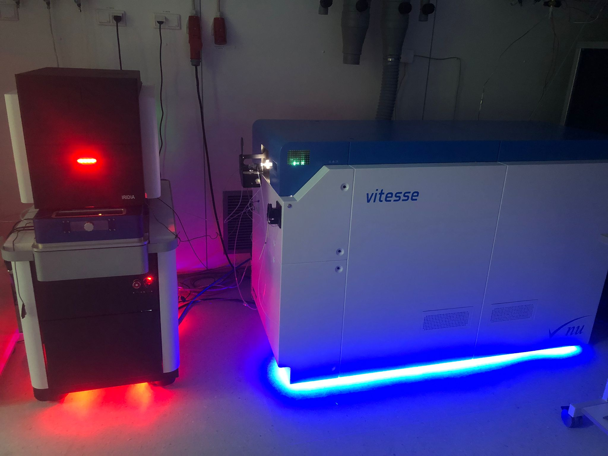

# Project Information

## Context

  
  

    AiCE will look at the question of signal reconstruction in deep ice specifically using chemical impurity signals which make up a large part of the ice core record about past atmospheric conditions. For this purpose, we take a new approach to study the oldest and highly thinned layers at unprecedented detail. While conventional meltwater analysis delivers 1D cm-resolution signals, we go into 2D by imaging the chemical impurity distribution at micro-metric scale in the solid ice core. This way, we can retrieve crucial information that is inevitably lost by melting: The same ice matrix preserving the climatic record can act on it and ultimately destroy it through various processes, causing impurities to relocate away from their original layer. Hence, the goal is to identify the original layering, by detecting post-depositional change through analyzing highly-dimensional chemical images.
  

---

## AI Integration

  

Human observers have clear limitations in detecting all the important details in such complex visual datasets. This is why AiCE will add deep learning to deep ice: Artificial intelligence (Ai) image analysis will be established through a comprehensive understanding of the chemical image features and their connection to post-depositional processes. With this, we can address the fundamental climate questions through deciphering deep ice – in Antarctica and elsewhere. Ultimately, AiCE could revolutionize how we interpret the oldest paleoclimate signals in ice cores and other archives.
    
  

---

<table>
  <tr>
    <td>
      
    </td>
    <td>
      
    </td>
  </tr>
</table>
