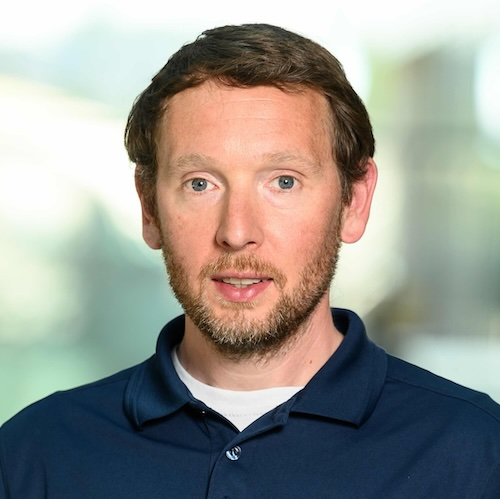
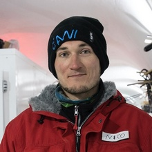
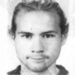
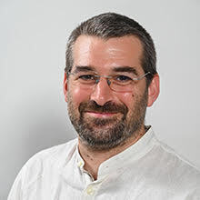
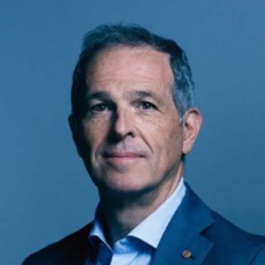
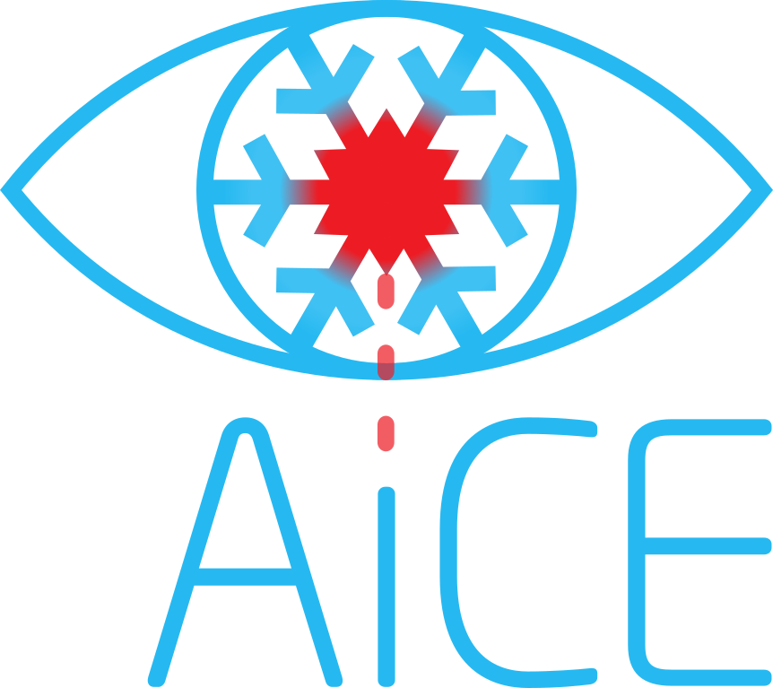

# AiCE Team

---

<table>
  <tr>
    <td align="center" style="padding: 20px;">
       
      <strong> <a href="https://www.awi.de/ueber-uns/organisation/mitarbeiter/detailseite/pascal-bohleber.html" target="_blank"> Pascal Bohleber </a>  </strong> 
      Principal investigator  
    </td>
    <td align="center" style="padding: 20px;">
       
      <strong> <a href="https://www.awi.de/en/about-us/organisation/staff/single-view/remi-dallmayr.html" target="_blank"> Rémi Dallmayr </a>  </strong> 
      Postdoc 
    </td>
    <td align="center" style="padding: 20px;">
       
      <strong> <a href="https://www.awi.de/en/about-us/organisation/staff/single-view/piers-larkman.html" target="_blank"> Piers Larkman </a>  </strong> 
      Postdoc 
    </td>
  </tr>
  <tr>
    <td align="center" style="padding: 20px;">
       
      <strong> <a href="https://www.awi.de/en/about-us/organisation/staff/single-view/ruben-rittberger.html" target="_blank"> Ruben Rittberger </a>  </strong> 
      PhD Student 
    </td>
  </tr>
  
</table>

---

# In Collaboration With

---

<table>
  <tr>
    <td align="center" style="padding: 20px;">
       
      <strong> <a href="https://www.unive.it/data/people/27488149" target="_blank"> Nicolas Stoll </a>  </strong> 
      Ca' Foscari University of Venice  
    </td>
    <td align="center" style="padding: 20px;">
       
      <strong> Martin Šala </strong> 
      National Institute of Chemistry, Ljubljana  
    </td>
    <td align="center" style="padding: 20px;">
       
      <strong> <a href="https://www.unive.it/data/persone/9588235" target="_blank"> Sebastiano Vascon </a>  </strong> 
      Ca' Foscari University of Venice 
    </td>
      </tr>
  <tr>
    <td align="center" style="padding: 20px;">
       
      <strong> <a href="https://online.uni-graz.at/kfu_online/wbForschungsportal.cbShowPortal?pPersonNr=131432&pMode=E" target="_blank"> David Clases </a>  </strong> 
      University of Graz 
    </td>
    <td align="center" style="padding: 20px;">
       
      <strong> <a href="https://www.unive.it/data/people/5590288" target="_blank"> Carlo Barbante </a>  </strong> 
      Ca' Foscari University of Venice 
    </td>
    <td align="center" style="padding: 20px;">
       
      <strong> <a href="https://www.unive.it/data/people/29111809" target="_blank"> Hasan Latif </a>  </strong> 
      Ca' Foscari University of Venice 
    </td>
  </tr>
  
</table>

---

<table>
  <tr>
    <td>
      
    </td>
    <td>
      
    </td>
  </tr>
</table>

